## 一、版本控制系统概述

### 1. 基本概念

版本控制（Revision control）是一种在开发的过程中用于管理我们对文件、目录或工程等内容的修改历史，方便查看更改历史记录，备份以便恢复以前的版本的软件工程技术。

- 实现跨区域多人协同开发
- 追踪和记载一个或者多个文件的历史记录
- 组织和保护你的源代码和文档
- 统计工作量
- 并行开发、提高开发效率
- 跟踪记录整个软件的开发过程
- 减轻开发人员的负担，节省时间，同时降低人为错误

简单说就是用于管理多人协同开发项目的技术。

没有进行版本控制或者版本控制本身缺乏正确的流程管理，在软件开发过程中将会引入很多问题，如软件代码的一致性、软件内容的冗余、软件过程的事物性、软件开发过程中的并发性、软件源代码的安全性，以及软件的整合等问题。


有了版本控制系统以后，就可以方便记录每次修改的版本了，类似于以下效果：

| 版本 | 文件名      | 用户 | 说明                   | 日期       |
| :--- | :---------- | :--- | :--------------------- | :--------- |
| 1    | service.doc | 张三 | 删除了软件服务条款5    | 7/12 10:38 |
| 2    | service.doc | 张三 | 增加了License人数限制  | 7/12 18:09 |
| 3    | service.doc | 李四 | 财务部门调整了合同金额 | 7/13 9:51  |
| 4    | service.doc | 张三 | 延长了免费升级周期     | 7/14 15:17 |

主流的版本控制器有如下这些：

- **Git**
- **SVN**（Subversion）
- **CVS**（Concurrent Versions System）
- **VSS**（Micorosoft Visual SourceSafe）
- **TFS**（Team Foundation Server）
- Visual Studio Online

版本控制产品非常的多，现在影响力最大且使用最广泛的是Git与SVN。

### 2. 版本控制分类

#### 集中式

集中式版本控制系统，版本库是集中存放在中央服务器的，团队成员需要先从中央服务器取得最新的版本，再将变动推送给中央服务器。

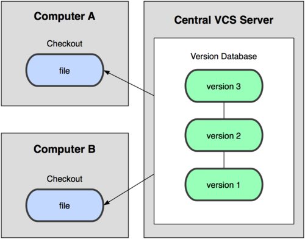

集中式版本控制系统主要问题在于中央服务器的故障。如果服务器宕机，那么谁都无法提交更新，也就无法协同工作，代表产品：SVN、CVS、VSS。

#### 分布式

分布式版本控制系统没有“中央服务器”，每个人的电脑上都是一个完整的版本库，这样任何一处协同工作用的文件发生故障，事后都可以用其他客户端的本地仓库进行恢复，分布式的版本控制系统出现之后,解决了集中式版本控制系统的缺陷:

- 服务器断网的情况下也可以进行开发（因为版本控制是在本地进行的）
- 每个客户端保存的也都是整个完整的项目（包含历史记录，更加安全）

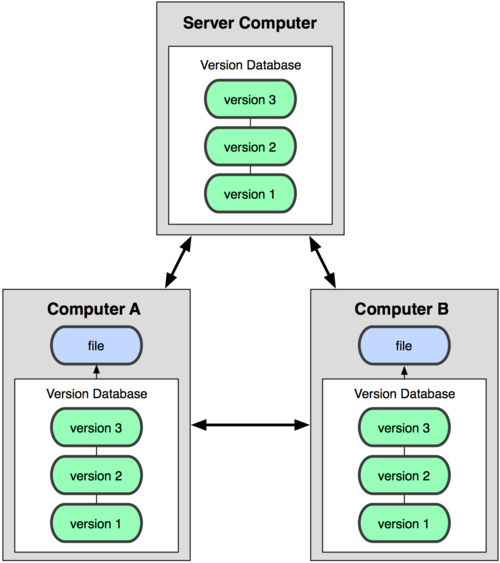

#### Git与SVN最主要区别

SVN是集中式版本控制系统，版本库是集中在中央服务器中，Git是分布式版本控制系统，没有中央服务器，每个人的电脑就是一个完整的版本库。

Git是目前世界上最先进的分布式版本控制系统，Git是免费、开源的。

### 3. 远程仓库

Git是分布式版本控制系统，同一个Git仓库，可以分布到不同的机器上，但开发参与者必须在同一个网络中，且必须有一个项目的原始版本，通常的办法是让一台电脑充当服务器的角色，每天24小时开机，其他每个人都从这个“服务器”仓库克隆一份到自己的电脑上，并且各自把各自的提交推送到服务器仓库里，也从服务器仓库中拉取别人的提交。完全可以自己搭建一台运行Git的服务器但现在更适合的做法是使用免费的托管平台。

同时相较于传统的代码都是管理到本机或者内网。 一旦本机或者内网机器出问题，代码可能会丢失，使用远端代码仓库将永远存在一个备份。同时也免去了搭建本地代码版本控制服务的繁琐。 云计算时代 Git 以其强大的分支和克隆功能，更加方便了开发者远程协作。

代码托管中心是基于网络服务器的远程代码仓库，一般我们简单称为远程库。

企业内部可以使用GitLab搭建远程仓库，也可以使用公网上开放的远程仓库，如GitHub，Gitee(码云)，阿里云效中的CodeUp。

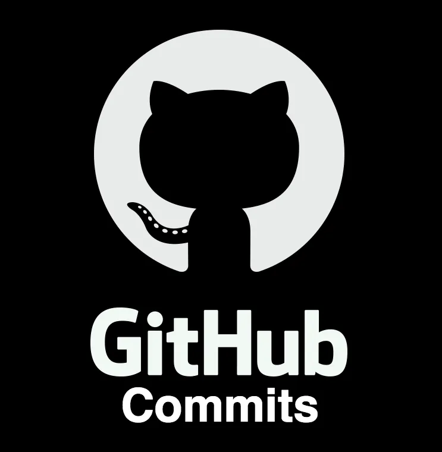

### 4. 安装

可以从Git官网直接[下载安装程序](https://git-scm.com/downloads)，然后按默认选项安装即可。

选择对应的平台下载

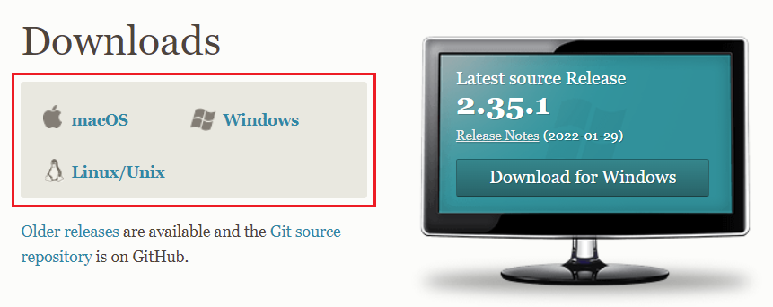

安装

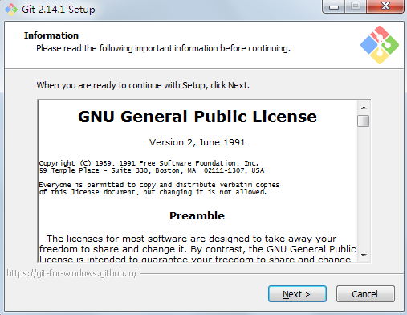

选择安装配置信息

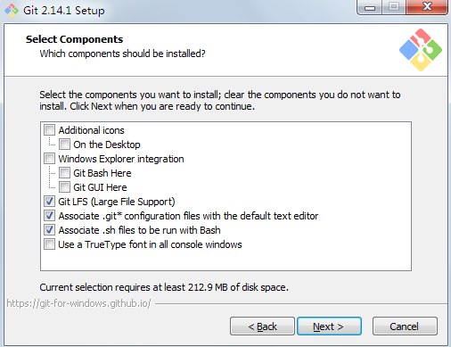

一直Next默认就好了。

安装完成后，在右键开始菜单里找到“Git”->“Git Bash”，就说明Git安装成功！

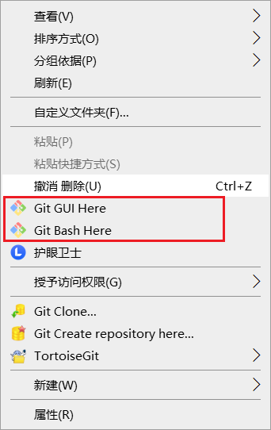

### 5. 工作机制

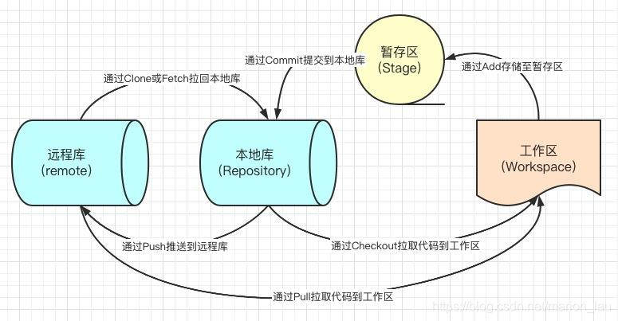

| 命令                            | 作用                                               |
| ------------------------------- | -------------------------------------------------- |
| git init                        | 初始化本地库                                       |
| git add 文件名                  | 添加到暂存区                                       |
| git commit -m "日志信息" 文件名 | 提交到本地库                                       |
| git status                      | 查看本地库状态                                     |
| git reflog                      | 查看历史记录                                       |
| git reset --hard 版本号         | 版本穿梭                                           |
| git push                        | 将本地仓库分支推送到远程仓库                       |
| git clone                       | 克隆仓库到本地                                     |
| git pull –rebase                | 拉取远程仓库的数据到本地远程分支，并进行rebase合并 |
| git merge / rebase：            | 合并分支                                           |

## 二、基本使用

### 1. 基本配置

~/.gitconfig文件保存了本用户的所有仓库的配置，可以通过命令: git config –global来设置

Git仓库在进行commit时，必须进行签名：

~~~shell
git config --global user.name 'username'
git config --global user.email 'email@163.com'
~~~

签名用于区分不同操作者身份，在提交信息中可以查看用户的签名，以此确认本次提交是谁做的。Git 首次安装必须设置一下用户签名，否则无法提交代码。

注意，此处设置的用户签名和远端代码托管中心的账号没有任何关系！

### 2. 常用操作

#### 初始化本地仓库

~~~shell
$ git init
Initialized empty Git repository in C:/xx/.git/
~~~

会在当前目录中自动创建.git目录，此目录用于Git跟踪管理版本库。

#### 查看本地库状态

无文件时：

~~~shell
$ git status
On branch master
No commits yet
nothing to commit (create/copy files and use "git add" to track)
~~~

新增文件后：

~~~shell
$ touch hello.txt
$ git status
On branch master
No commits yet
Untracked files:
  (use "git add <file>..." to include in what will be committed)
        hello.txt
nothing added to commit but untracked files present (use "git add" to track)
~~~

#### 添加文件至暂存区

~~~shell
git add 文件名
~~~

添加hello.txt至暂存区

~~~shell
$ git add hello.txt
~~~

查看状态

~~~shell
$ git status
On branch master
No commits yet
Changes to be committed:
  (use "git rm --cached <file>..." to unstage)
        new file:   hello.txt
~~~

#### 提交至本地库

~~~shell
git commit -m "日志信息"
~~~

~~~shell
$ git commit -m "测试"
[master (root-commit) 5e97c57] 测试
 1 file changed, 0 insertions(+), 0 deletions(-)
 create mode 100644 hello.txt
~~~

查看状态

~~~shell
$ git status
On branch master
nothing to commit, working tree clean
~~~

#### 管理修改

修改hello.txt后，再次查看状态

~~~shell
$ git status
On branch master
Changes not staged for commit:
  (use "git add <file>..." to update what will be committed)
  (use "git restore <file>..." to discard changes in working directory)
        modified:   hello.txt

no changes added to commit (use "git add" and/or "git commit -a")
~~~

重新添加至暂存区

~~~shell
$ git add hello.txt
$ git status
On branch master
Changes to be committed:
  (use "git restore --staged <file>..." to unstage)
        modified:   hello.txt
~~~

再次提交

~~~shell
$ git commit -m "修改了hello.txt"
[master 575cf6c] 修改了hello.txt
 1 file changed, 1 insertion(+)
~~~

**撤销修改**

`git checkout -- file`可以丢弃工作区的修改

~~~shell
$ git checkout -- hello.txt
~~~

- 当文件自修改后还没有被放到暂存区( add )时，撤销修改就回到和版本库一模一样的状态

- 当文件已经添加到暂存区后，又作了修改，撤销修改就回到添加到暂存区后的状态

#### 版本穿梭

~~~shell
git reset --hard 版本号
~~~

可以通过`git reflog`查看版本信息

~~~shell
$ git reflog
575cf6c (HEAD -> master) HEAD@{0}: commit: 修改了hello.txt
5e97c57 HEAD@{1}: commit (initial): 测试
~~~

切换到`5e97c57`版本

~~~shell
$ git reset --hard 5e97c57
HEAD is now at 5e97c57 测试
~~~

### 3. 分支操作

#### 基本概念

假设你准备开发一个新功能，但是需要两周才能完成，第一周你写了50%的代码，如果立刻提交，由于代码还没写完，不完整的代码库会导致别人不能干活了。如果等代码全部写完再一次提交，又存在丢失每天进度的巨大风险。

这时可以创建一个属于你自己的分支，别人看不到，还继续在原来的分支上正常工作，而你在自己的分支上干活，想提交就提交，直到开发完毕后，再一次性合并到原来的分支上，这样，既安全，又不影响别人工作。

在版本控制过程中，同时推进多个任务，为每个任务，我们就可以创建每个任务的单独分支。使用分支意味着程序员可以把自己的工作从开发主线上分离开来，开发自己分支的时候，不会影响主线分支的运行。

每次提交时，Git都把它们串成一条时间线，这条时间线就是一个分支。截止到目前，只有一条时间线，在Git里，这个分支叫主分支，即`master`分支。同时会有一个`HEAD`指针指向当前分支，而`master`指向最新的提交。


每次提交，`master`分支都会向前移动一步，这样，随着你不断提交，`master`分支的线也越来越长。

当我们创建新的分支，例如`dev`时，Git新建了一个指针叫`dev`，指向`master`相同的提交，再把`HEAD`指向`dev`，就表示当前分支在`dev`上：


从现在开始，对工作区的修改和提交就是针对`dev`分支了，比如新提交一次后，`dev`指针往前移动一步，而`master`指针不变：

.png)

假如我们在`dev`上的工作完成了，就可以把`dev`合并到`master`上。Git怎么合并呢？最简单的方法，就是直接把`master`指向`dev`的当前提交，就完成了合并：

.png)

合并完分支后，甚至可以删除`dev`分支。删除`dev`分支就是把`dev`指针给删掉，删掉后，我们就剩下了一条`master`分支：

.png)

| 命令                 | 作用                         |
| -------------------- | ---------------------------- |
| git branch 分支名    | 创建分支                     |
| git branch -v        | 查看分支                     |
| git checkout 分支名  | 切换分支                     |
| git merge 分支名     | 把指定的分支合并到当前分支上 |
| git branch -d 分支名 | 删除分支                     |

#### 查看分支

~~~shell
$ git branch -v
* master 5e97c57 测试
~~~

#### 创建分支

*表示目前所在的分支

~~~shell
$ git branch dev
$ git branch -v
  dev    5e97c57 测试
* master 5e97c57 测试
~~~

#### 切换分支

~~~shell
$ git checkout dev
Switched to branch 'dev'
$ git branch -v
* dev    5e97c57 测试
  master 5e97c57 测试
~~~

#### 合并分支

在dev分支上修改`hello.txt`文件，添加如下内容


添加至暂存区，并提交至本地版本库

~~~shell
$ git add hello.txt
$ git commit -m 'dev commit'
~~~

切换至master分支，在master分支上合并dev分支

~~~shell
$ git checkout master
$ cat hello.txt # 没有dev分支的内容
# 执行合并
$ git merge dev
# 查看文件内容
$ cat hello.txt # 此时可以看到dev分支修改的内容
~~~

#### 合并冲突

合并分支时，两个分支在**同一个文件的同一个位置**有两套完全不同的修改。Git 无法替我们决定使用哪一个。必须**人为决定**新代码内容。

在master分支上修改`hello.txt`文件并提交至版本库

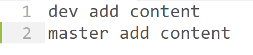

在dev分支上修改`hello.txt`文件并提交至版本库

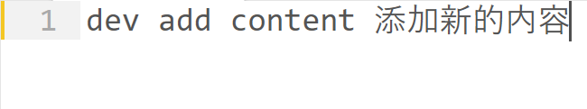

切换回master分支，将dev分支内容合并至master分支，发现合并失败，此时需要手动解决冲突。

~~~shell
$ git merge dev
Auto-merging hello.txt
CONFLICT (content): Merge conflict in hello.txt
Automatic merge failed; fix conflicts and then commit the result.
~~~

当出现冲突时，会有状态提示：

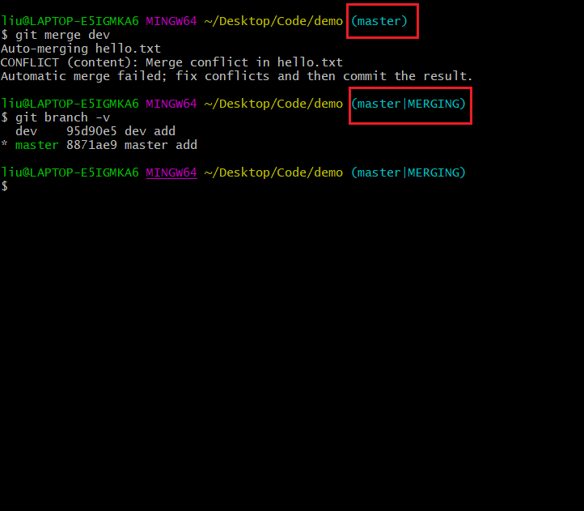

#### 解决冲突

查看`hello.txt`文件：

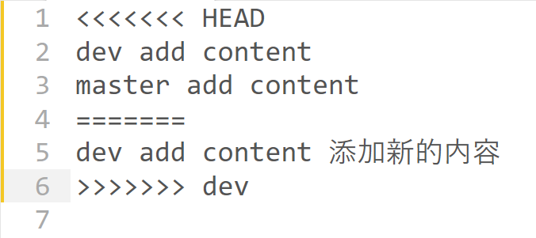

上述格式为：

~~~
<<<<<<< HEAD
当前分支的代码
========
合并过来的代码
>>>>>>> dev
~~~

编辑有冲突的文件，删除特殊符号，决定要使用的内容，决定保留当前分支的内容

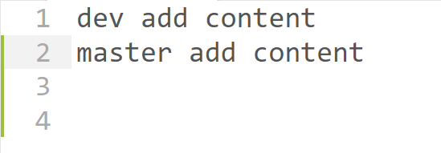

添加，并提交修改后的文件，注意此步骤非常重要，需要将修改后的内容进行提交！

~~~shell
$ git add hello.txt
$ git commit -m 'master commit'
~~~

冲突解决后，状态发生了变化

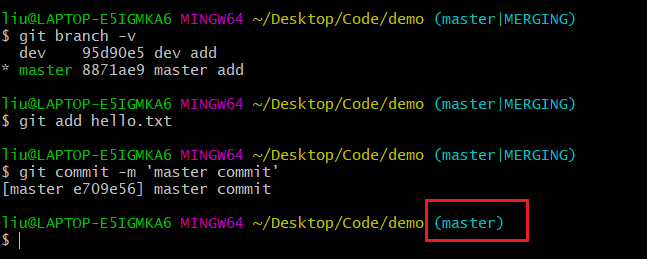

### 4. 分支管理策略

#### 禁用`Fast forward`

通常，合并分支时，如果可能，Git会用`Fast forward`模式（既直接移动指针），但这种模式下，删除分支后，会丢掉分支信息。

注意：如果分叉后，master和dev均产生了新的提交，则无法适用于Fast forward模式，此时分为两种情况：

- 若合并分支出现冲突，则需要解决冲突，并手动提交改动后的内容。

- 若合并分支没有出现冲突，则合并时，会出现下方提示，需要先键入`i`，输入具体提交信息，然后键入`ESC`,再输入`:wq`保存退出（参考VIM命令）。因为此时无法使用`Fast forward`模式，需要以新提交的方式进行合并。合并完成后，可以通过`git log --graph --pretty=oneline --abbrev-commit`指令以图形方式查看各个分支的提交历史。

  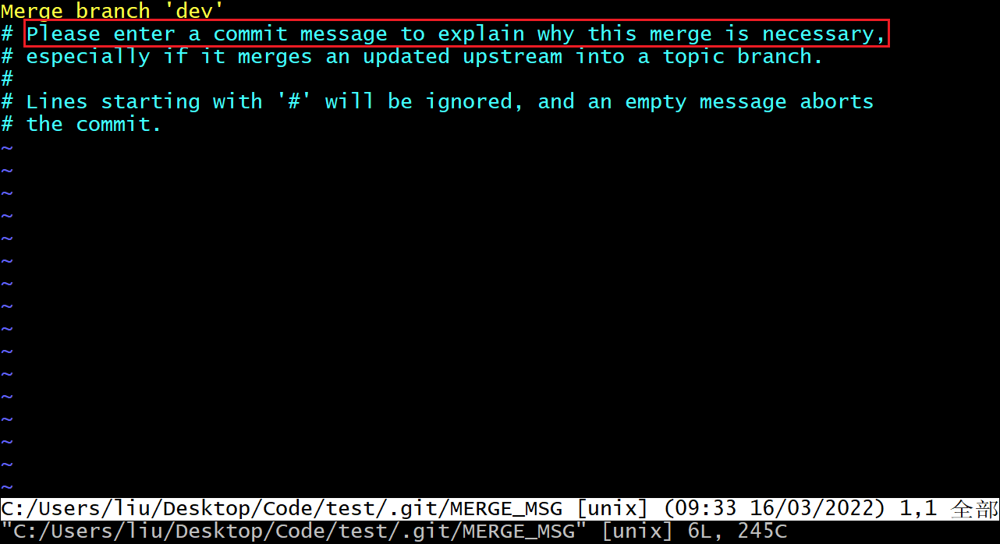

如果要强制禁用`Fast forward`模式，Git则会在merge时自动生成一个新的commit，这样，从分支历史上就可以看出分支信息。

下面我们实战一下`--no-ff`方式的`git merge`：

首先，仍然创建并切换`dev`分支：

```shell
$ git switch -c dev
Switched to a new branch 'dev'
```

修改文件，并提交一个新的commit：

```shell
$ git add readme.txt 
$ git commit -m "add merge"
[dev f52c633] add merge
 1 file changed, 1 insertion(+)
```

现在，我们切换回`master`：

```shell
$ git switch master
Switched to branch 'master'
```

准备合并`dev`分支，请注意`--no-ff`参数，表示禁用`Fast forward`：

```shell
$ git merge --no-ff -m "merge with no-ff" dev
Merge made by the 'recursive' strategy.
 readme.txt | 1 +
 1 file changed, 1 insertion(+)
```

因为本次合并要创建一个新的commit，所以加上`-m`参数，把commit描述写进去。

合并后，我们用`git log`看看分支历史：

```shell
$ git log --graph --pretty=oneline --abbrev-commit
*   e1e9c68 (HEAD -> master) merge with no-ff
|\  
| * f52c633 (dev) add merge
|/  
*   cf810e4 conflict fixed
...
```

可以看到，不使用`Fast forward`模式，merge后就像这样：


而默认情况下：

.png)

#### 分支策略

在实际开发中，我们应该按照几个基本原则进行分支管理：

首先，`master`分支应该是非常稳定的，也就是仅用来发布新版本，平时不能在上面干活；

那在哪干活呢？干活都在`dev`分支上，也就是说，`dev`分支是不稳定的，到某个时候，比如1.0版本发布时，再把`dev`分支合并到`master`上，在`master`分支发布1.0版本；

你和你的小伙伴们每个人都在`dev`分支上干活，每个人都有自己的分支，时不时地往`dev`分支上合并就可以了。

所以，团队合作的分支看起来就像这样：

-16473192044892.png)


## 三、 远程仓库（码云）

### 1. 注册码云账号

访问链接：https://gitee.com/signup 使用邮箱或手机注册账号

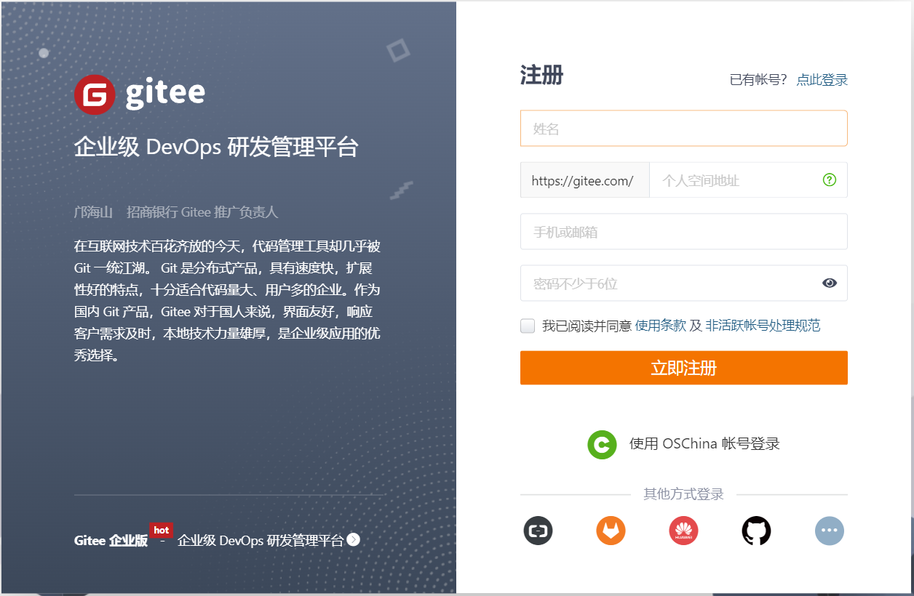

### 2. 创建远程仓库

点击右上角 “+” 选择新建仓库

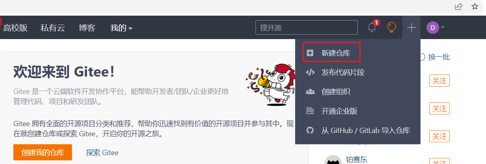

填写仓库名称，仓库路径会根据名称自动生成，最后点击创建。

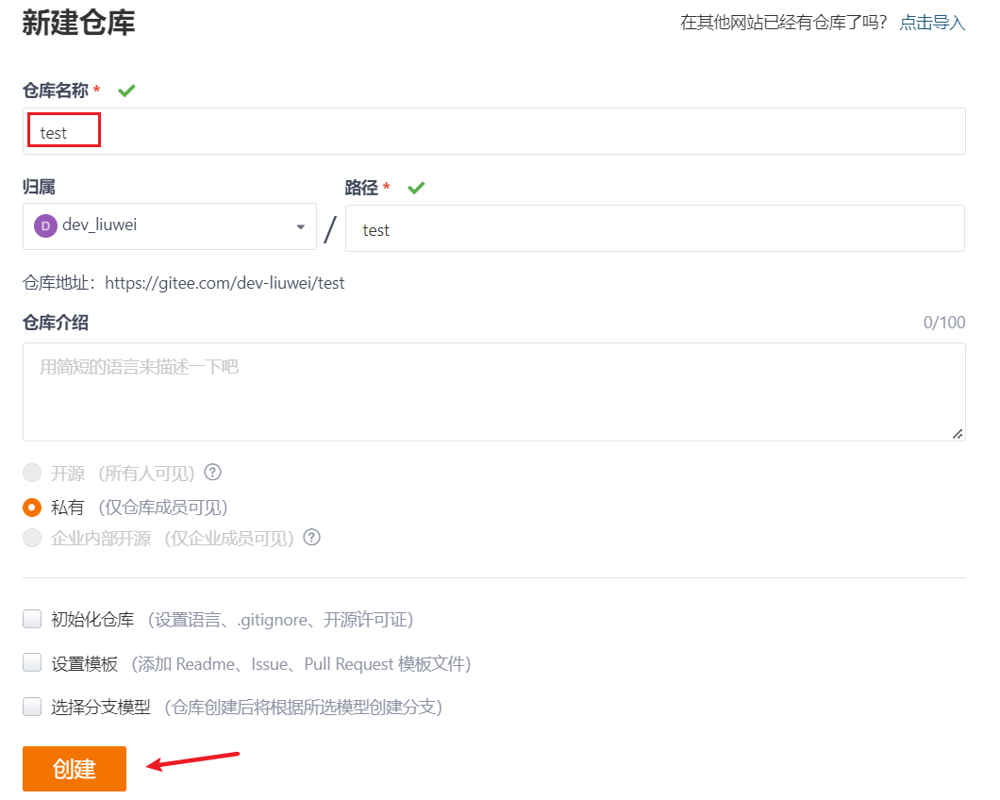

### 2. 设置SSH

仓库创建后，默认提供了两种仓库地址：

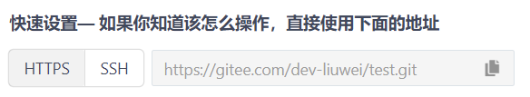

上述地址用于本地与远程代码库关联，HTTPS与SSH分别以不同的传输协议与远程仓库进行代码传输。

- 若使用HTTPS方式，后续在上传代码时，需要在本地输入码云的账号密码进行验证：

- 若使用SSH方式则需要在本地生成秘钥，并将生成的公钥信息上传至平台，后续上传代码时就不需要输入账号密码了，此种方式较为方便。

接下来讲解如何在本地生成SSH秘钥，并上传至码云。

可以按如下命令来生成 sshkey，注意如果使用的是Windows系统，则需要在**Git Bash**中使用命令，如果在CMD中会出现不识别命令的情况。

~~~shell
ssh-keygen -t ed25519 -C "xxxxx@xxxxx.com" 
~~~

注意：这里的 `xxxxx@xxxxx.com` 只是生成的 sshkey 的名称，并不约束或要求具体命名为某个邮箱。

按照提示完成三次回车，即可生成 ssh key。

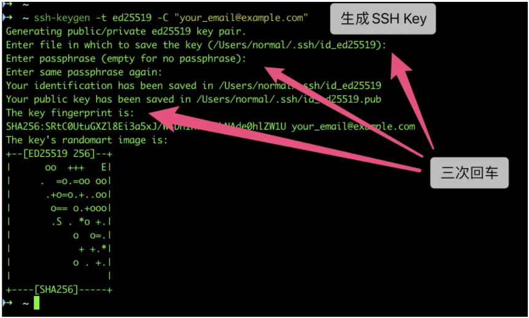

通过查看 `~/.ssh/id_ed25519.pub` 文件内容，获取到你的 public key。

~~~shell
cat ~/.ssh/id_ed25519.pub
~~~

复制生成后的公钥（id_ed25519.pub）信息，跳转到**个人设置**，注意不是仓库设置！点击SSH公钥，将本地生成的信息添加到码云中。

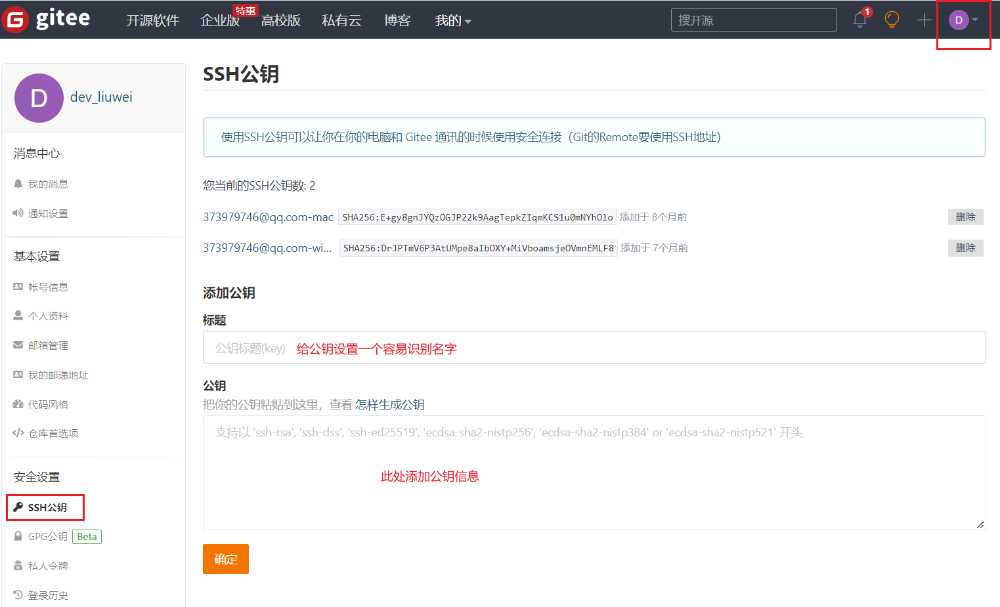

### 3. 远程仓库操作

| 命令                               | 作用                                             |
| ---------------------------------- | ------------------------------------------------ |
| git remote -v                      | 查看当前所有远程地址别名                         |
| git remote add 别名 远程地址       | 将别名与远程地址关联                             |
| git push 别名 分支                 | 推送本地分支上的内容到远程仓库                   |
| git clone 远程地址                 | 将远程仓库的内容克隆到本地                       |
| git pull 远程库地址别名 远程分支名 | 将远程仓库对应分支内容拉下来后与当前本地分支合并 |
| git remote rm 别名                 | 删除别名与远程的关联                             |

#### 添加远程仓库别名

~~~shell
$ git remote add origin git@gitee.com:dev-liuwei/webcode.git
~~~

添加后，远程库的名字就是`origin`，这是Git默认的叫法，也可以改成别的，但是`origin`这个名字一看就知道是远程库。

查看当前所有远程地址别名

~~~shell
$ git remote -v
origin  git@gitee.com:dev-liuwei/test.git (fetch)
origin  git@gitee.com:dev-liuwei/test.git (push)
~~~

#### 推送分支

~~~shell
$ git push origin master
Enumerating objects: 3, done.
Counting objects: 100% (3/3), done.
Writing objects: 100% (3/3), 197 bytes | 197.00 KiB/s, done.
Total 3 (delta 0), reused 0 (delta 0)
remote: Powered by GITEE.COM [GNK-6.3]
To gitee.com:dev-liuwei/test.git
 * [new branch]      master -> master
~~~

如果要推送其他分支，比如`dev`，就改成：

```shell
$ git push origin dev
```

#### 克隆远程仓库到本地

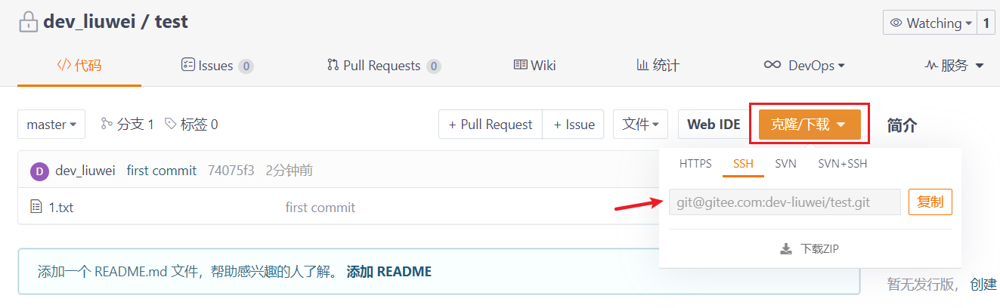

~~~shell
$ git clone git@gitee.com:dev-liuwei/test.git
~~~

~~~shell
$ cd test
$ git remote -v
origin  git@gitee.com:dev-liuwei/test.git (fetch)
origin  git@gitee.com:dev-liuwei/test.git (push)
~~~

克隆操作会拉去远程仓库代码，并初始化本地仓库，同时建立别名。

#### 拉取分支

~~~shell
$ git pull origin master
~~~

克隆时，默认只会拉取远程的master分支，如果需要在其他分支上工作，则需要单独拉取，执行以下命令，本地分支会基于远程origin/dev创建，并与之关联。

~~~shell
$ git checkout -b dev origin/dev
~~~

上述操作因为非常常见，当checkout的分支不存在且与远端分支名字相同时，则可以进行简化： 

~~~shell
$ git checkout dev
~~~

现在，就可以在`dev`上继续修改，然后，时不时地把`dev`分支`push`到远程：

```shell
$ git push origin dev
```

#### 分支关联

如果本地的分支是直接创建出来的（git branch 分支名称）,则本地的分支与远程的分支默认是无关联的，若只使用`git pull` 或 `git push`，没有指定分支，则会提示先进行分支关联，

~~~shell
$ git push
fatal: The current branch dev has no upstream branch.
To push the current branch and set the remote as upstream, use

    git push --set-upstream origin dev
~~~

可以建立本地分支和远程分支的关联

~~~shell
# git branch --set-upstream branch-name origin/branch-name
$ git branch --set-upstream dev origin/dev
$ git push --set-upstream origin test
~~~

这样后续就可以直接使用`git pull` 或 `git push`进行操作了

也可以在push时，添加`-u`参数，如：

```shell
$ git push -u origin dev
```

查看本地分支与远程分支的关联关系：

~~~shell
$ git branch -vv
~~~

### 4. 注意事项

从本地推送分支，如果远端已经有了新的提交，则使用git push时，会推送失败

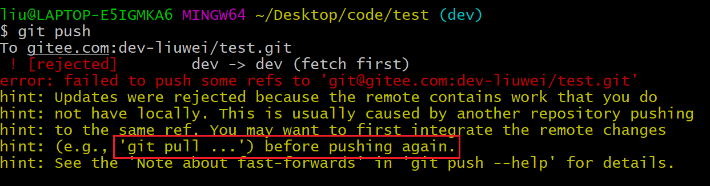

此时应该先`git pull`，拉取远端新的提交至本地。

`git pull`命令相当于`git fetch`+`git merge`，也就是将远程分支内容拉取到本地，再与本地分支进行合并，因此如果远端有新的提交，本地也有新的提交，则需要以提交的方式进行合并，有可能会产生冲突，需要手动解决（参考分支合并章节）。

## 四、idea编程工具Git操作

### 1. 环境准备

#### 检查Git环境

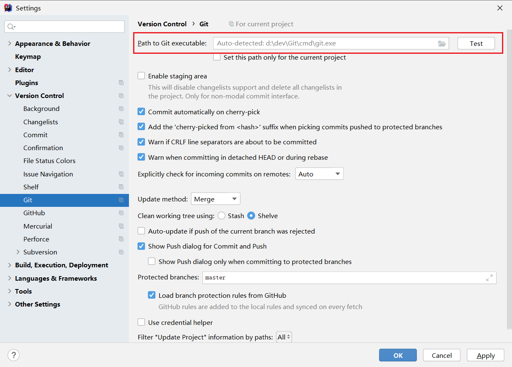

#### 初始化本地库

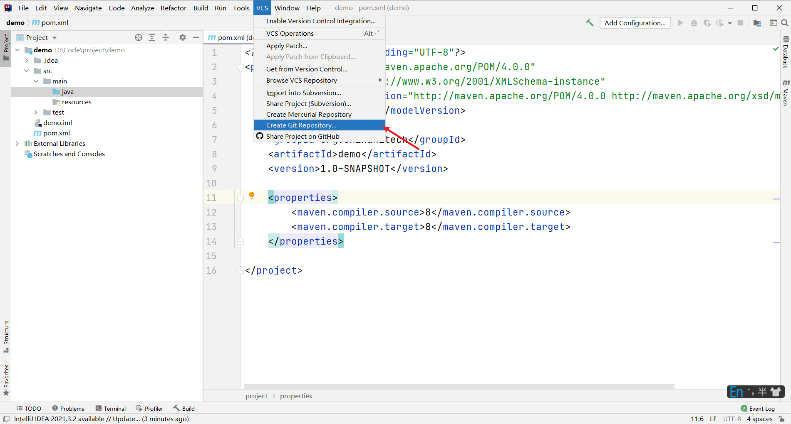

#### 配置gitignore文件

.gitignore用于指定哪些文件不需要添加到版本管理中

```swift
/mtk/ 过滤整个文件夹
*.zip 过滤所有.zip文件
/mtk/do.c 过滤某个具体文件
```

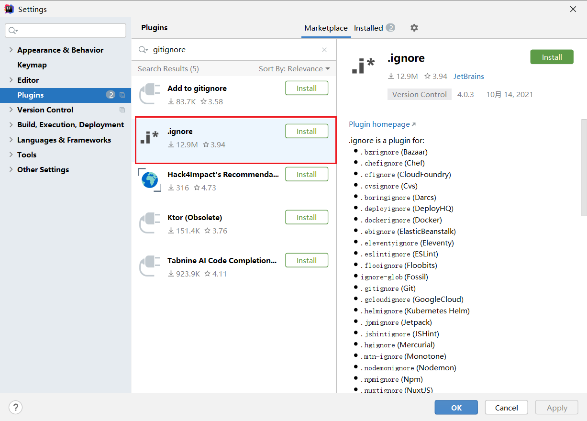

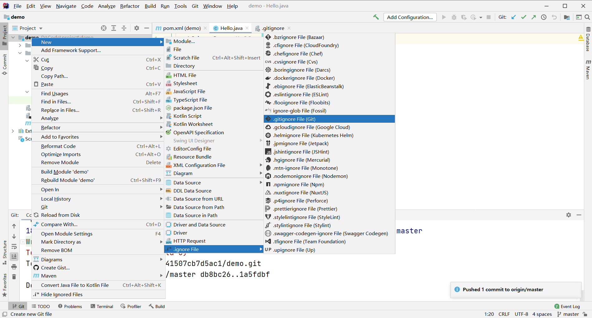

### 2. 常见操作

#### 添加到暂存区

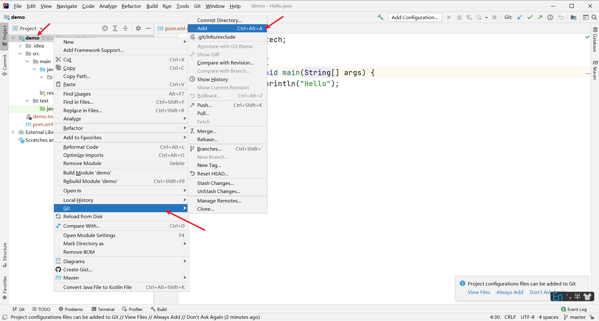

#### 提交到本地库

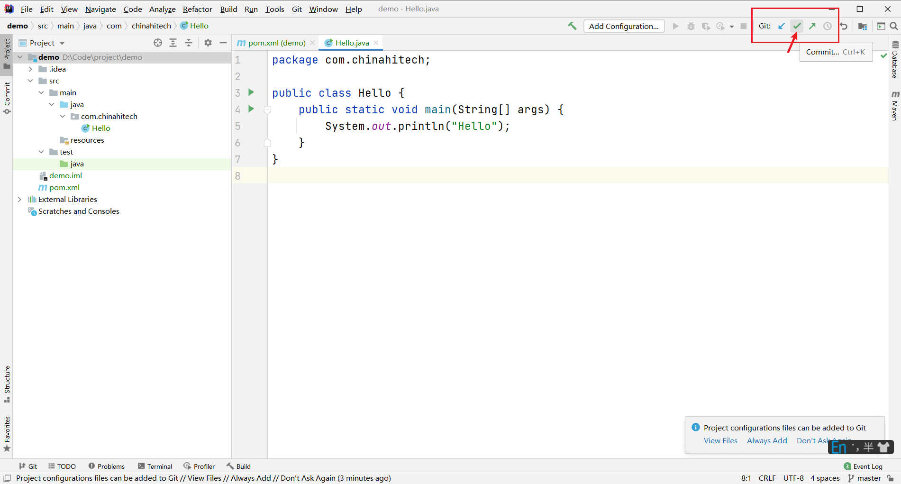

#### 查看历史提交信息

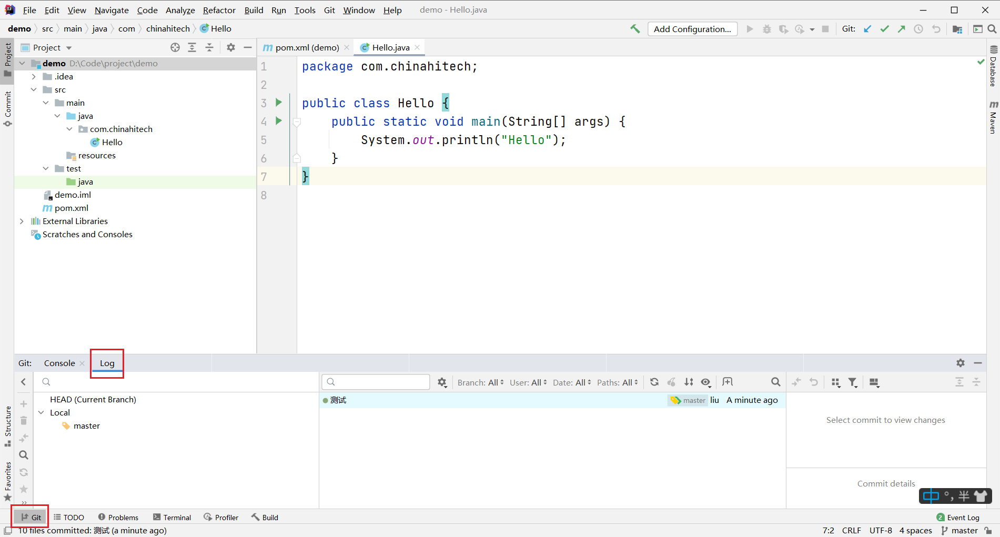

#### 创建及切换分支

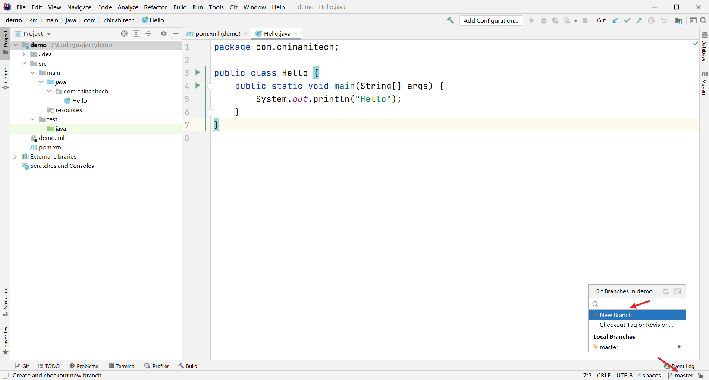

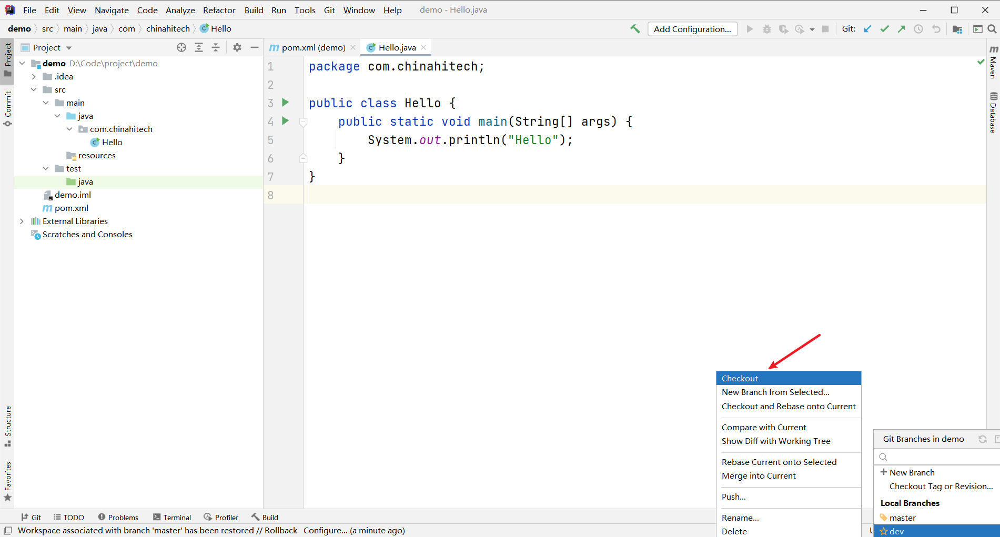

#### 合并分支

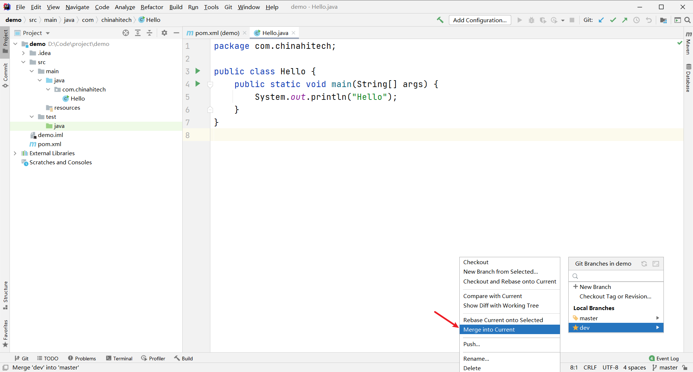

### 3. 远程仓库操作

#### 关联远程仓库

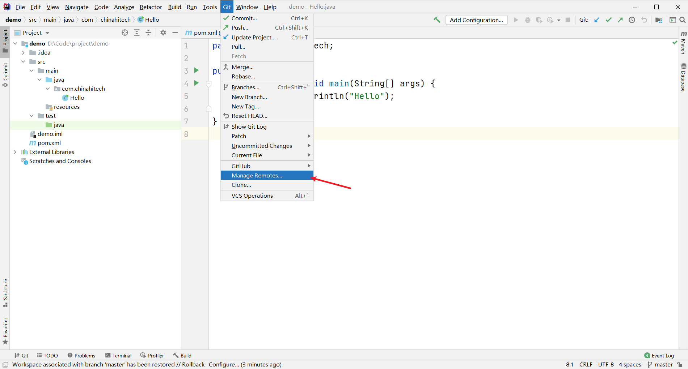

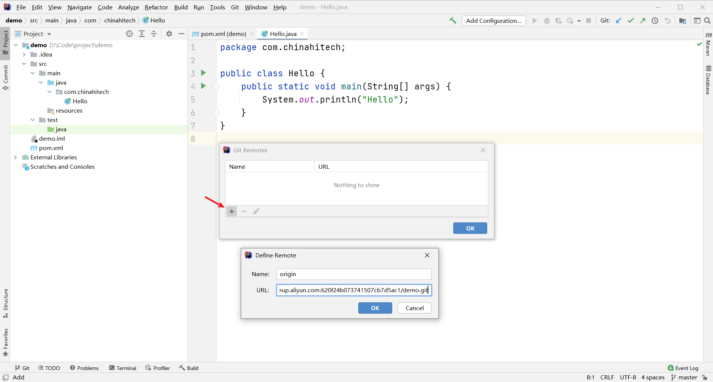

#### 推送与拉取


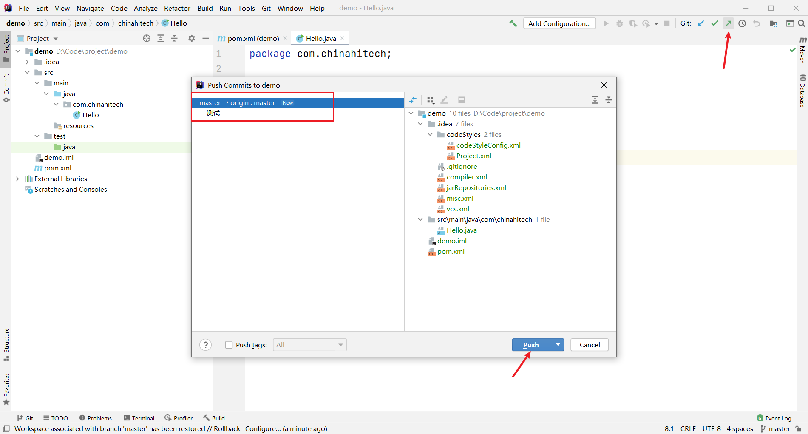

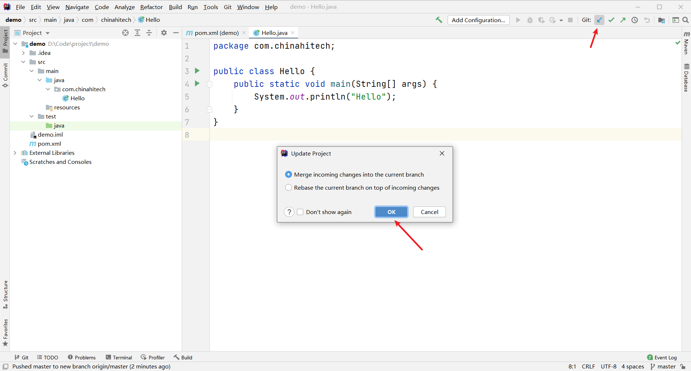

#### 克隆

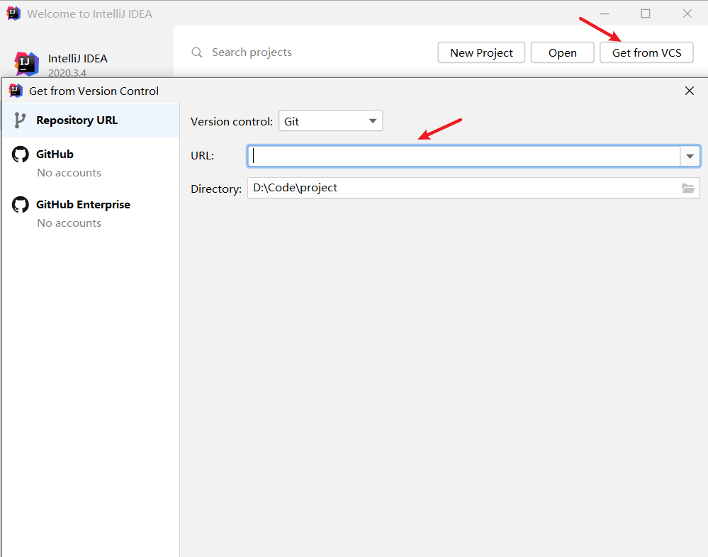


## 五、团队协作

### 1. 添加协作成员

点击到仓库管理界面，可以给对应仓库添加协作成员。

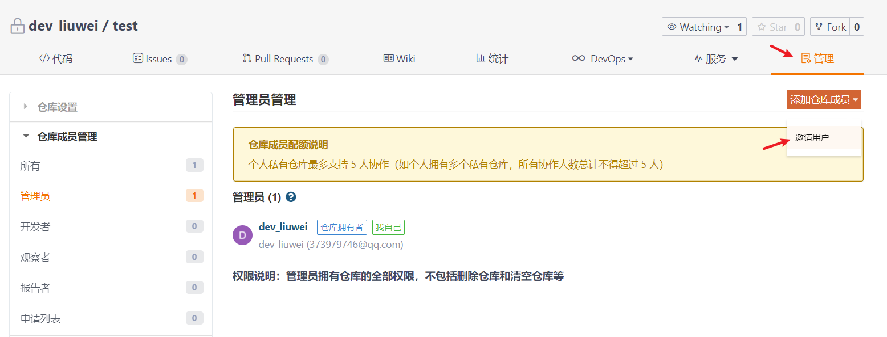

### 2. 团队协作建议

1. 组长在本地设计项目结构，并推送到远程仓库
2. 组员将远程仓库克隆到本地
3. 组员在本地创建分支进行协作开发，分支可以以组员名称命名。
4. 组员将自己的分支推送到远程仓库
5. 当代码确认没有问题后，告诉组长，组长进行分支合并

## 六、参考资料

https://learngitbranching.js.org/?locale=zh_CN

https://geeeeeeeeek.github.io/git-recipes/

Git - Book：https://git-scm.com/book/zh/v2/

廖雪峰 Git教程：https://www.liaoxuefeng.com/wiki/896043488029600

深入浅出Git教程：https://www.cnblogs.com/syp172654682/p/7689328.html
